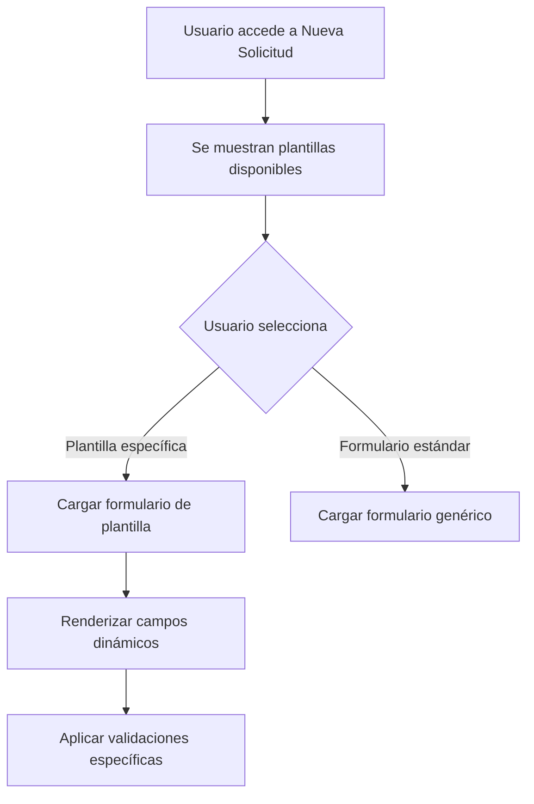
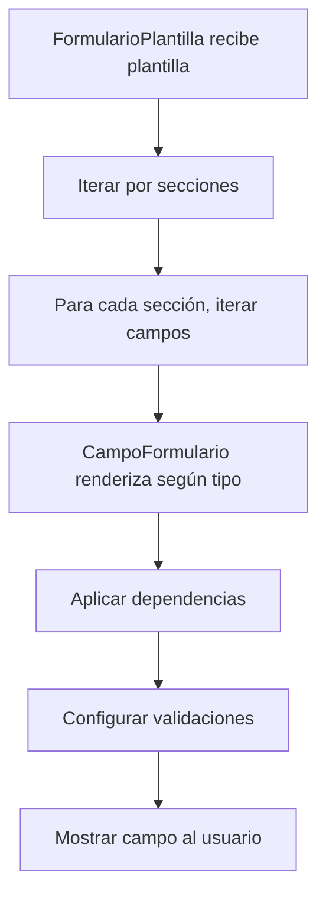
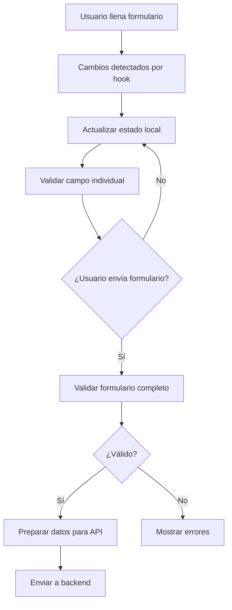

# Sistema de Plantillas Dinámicas - Documentación Completa

## 📋 Introducción

El Sistema de Plantillas Dinámicas permite crear formularios especializados para diferentes tipos de solicitudes de pago, reemplazando el formulario genérico con interfaces específicas que se adaptan a las necesidades particulares de cada tipo de solicitud.

## 🏗️ Arquitectura del Sistema

### Estructura de Archivos

```
src/
├── 📁 types/
│   └── plantillas.ts               # Definiciones de tipos TypeScript
├── 📁 data/
│   └── plantillas.ts               # Configuración de plantillas disponibles
├── 📁 hooks/
│   └── usePlantillaSolicitud.ts    # Hook para manejo de estado
├── 📁 components/plantillas/
│   ├── SelectorPlantillas.tsx      # Selector de plantilla
│   ├── CampoFormulario.tsx         # Renderizador de campos dinámicos
│   └── FormularioPlantilla.tsx     # Contenedor de formulario
└── 📁 app/dashboard/solicitante/nueva-solicitud/
    └── page.tsx                    # Página principal integrada
```

## 📚 Tipos y Interfaces

### TipoCampo
Define los tipos de campos disponibles en el sistema:

```typescript
export type TipoCampo = 
  | 'texto'         // Input de texto simple
  | 'numero'        // Input numérico
  | 'moneda'        // Input con formato de moneda
  | 'email'         // Input de email con validación
  | 'telefono'      // Input de teléfono
  | 'fecha'         // Selector de fecha
  | 'select'        // Lista desplegable
  | 'radio'         // Botones de radio
  | 'checkbox'      // Casillas de verificación
  | 'textarea'      // Área de texto multilínea
  | 'archivo'       // Carga de archivos
  | 'banco'         // Selector de banco
  | 'cuenta_clabe'; // Input para cuenta/CLABE
```

### CampoPlantilla
Estructura completa de un campo:

```typescript
export interface CampoPlantilla {
  id: string;                    // Identificador único
  nombre: string;                // Nombre del campo en el formulario
  tipo: TipoCampo;              // Tipo de campo
  etiqueta: string;             // Etiqueta visible
  placeholder?: string;          // Texto de ayuda
  ayuda?: string;               // Descripción detallada
  valorPorDefecto?: any;        // Valor inicial
  opciones?: OpcionCampo[];     // Opciones para select/radio
  validaciones?: {              // Reglas de validación
    requerido?: boolean;
    minLength?: number;
    maxLength?: number;
    patron?: string;
    soloNumeros?: boolean;
    mensaje?: string;
  };
  dependencias?: Dependencia[]; // Campos que afectan la visibilidad
  estilos?: {                   // Configuración de presentación
    ancho?: 'completo' | 'medio' | 'tercio';
    clase?: string;
  };
}
```

### PlantillaSolicitud
Estructura completa de una plantilla:

```typescript
export interface PlantillaSolicitud {
  id: string;                   // Identificador único de plantilla
  nombre: string;               // Nombre descriptivo
  descripcion: string;          // Descripción de uso
  version: string;              // Versión de la plantilla
  activa: boolean;              // Estado activo/inactivo
  icono: string;                // Emoji o icono
  color: string;                // Color temático
  categoria: string;            // Categoría de agrupación
  secciones: SeccionPlantilla[]; // Secciones del formulario
  configuracion: {              // Configuración especial
    permiteArchivosMultiples: boolean;
    tiposArchivosPermitidos: string[];
    tamanoMaximoArchivo: number;
    mostrarProgreso: boolean;
  };
  metadatos: {                  // Información de sistema
    creadoPor: string;
    fechaCreacion: string;
    fechaModificacion: string;
    usosFrecuentes: number;
  };
}
```

## 🔧 Componentes del Sistema

### 1. SelectorPlantillas.tsx
**Propósito:** Permite al usuario elegir entre plantillas disponibles o usar el formulario estándar.

**Características:**
- Muestra tarjetas con información de cada plantilla
- Incluye iconos, nombres y descripciones
- Botón para alternar al formulario estándar
- Responsive design

**Props:**
```typescript
interface SelectorPlantillasProps {
  plantillas: PlantillaSolicitud[];
  plantillaSeleccionada: string | null;
  onSeleccionar: (plantillaId: string | null) => void;
}
```

### 2. CampoFormulario.tsx
**Propósito:** Renderiza dinámicamente cualquier tipo de campo basándose en su configuración.

**Tipos de campo soportados:**
- **texto:** Input básico con validaciones
- **numero:** Input numérico con restricciones
- **moneda:** Formato de moneda con separadores
- **email:** Validación de formato de email
- **fecha:** DatePicker con configuración local
- **select:** Lista desplegable con opciones
- **radio:** Grupo de botones de radio
- **archivo:** Carga múltiple de archivos con validación
- **banco:** Selector especializado de bancos
- **cuenta_clabe:** Input para cuentas bancarias

**Validaciones automáticas:**
- Campos requeridos
- Longitud mínima/máxima
- Patrones regex
- Validación de tipos de archivo
- Tamaño máximo de archivos

### 3. FormularioPlantilla.tsx
**Propósito:** Contenedor principal que organiza las secciones y campos de una plantilla.

**Características:**
- Renderizado por secciones
- Manejo de dependencias entre campos
- Validación integral del formulario
- Integración con el sistema de archivos

### 4. usePlantillaSolicitud.ts
**Propósito:** Hook personalizado para manejo de estado del formulario de plantillas.

**Funcionalidades:**
```typescript
const {
  plantillaSeleccionada,      // Plantilla actualmente seleccionada
  datosFormulario,            // Datos del formulario actual
  errores,                    // Errores de validación
  seleccionarPlantilla,       // Función para cambiar plantilla
  actualizarCampo,            // Función para actualizar un campo
  validarFormulario,          // Función de validación
  reiniciarFormulario         // Función para limpiar datos
} = usePlantillaSolicitud();
```

## 📝 Plantilla Actual: Tarjetas N09 y TOKA

### Descripción
Plantilla especializada para solicitudes de pago a proveedores de tarjetas N09 y fondeo de tarjeta TOKA mediante TOKA.

### Estructura

#### Sección 1: Información Básica
- **Asunto:** Radio buttons para elegir entre:
  - "PAGO A PROVEEDOR DE TARJETA N09"
  - "TOKA PARA FONDEO TARJETA"
- **Beneficiario:** Campo de texto para el nombre del beneficiario

#### Sección 2: Datos Bancarios
- **Tipo de Cuenta:** Radio buttons (CLABE/Cuenta)
- **Número de Cuenta:** Input con validación numérica
- **Banco Destino:** Selector de banco (por defecto: STP)

#### Sección 3: Información del Pago
- **Monto:** Input con formato de moneda
- **Moneda:** Selector (MXN, USD, EUR)

#### Sección 4: Documentos
- **Archivos Adjuntos:** Carga múltiple de archivos
  - Tipos permitidos: PDF, imágenes, Excel, Word
  - Tamaño máximo: 10MB por archivo
  - Mínimo 1 archivo requerido

## 🚀 Cómo Agregar una Nueva Plantilla

### Paso 1: Definir la Plantilla
Crear el objeto de configuración en `src/data/plantillas.ts`:

```typescript
export const nuevaPlantilla: PlantillaSolicitud = {
  id: 'nueva-plantilla-id',
  nombre: 'Nombre de la Nueva Plantilla',
  descripcion: 'Descripción de qué casos de uso cubre',
  version: '1.0',
  activa: true,
  icono: '📄', // Emoji descriptivo
  color: 'green', // Color temático
  categoria: 'Categoría Correspondiente',
  secciones: [
    {
      id: 'seccion-1',
      titulo: 'Título de la Sección',
      descripcion: 'Descripción de la sección',
      campos: [
        {
          id: 'campo-1',
          nombre: 'nombre_del_campo',
          tipo: 'texto',
          etiqueta: 'Etiqueta del Campo',
          ayuda: 'Texto de ayuda para el usuario',
          validaciones: {
            requerido: true,
            mensaje: 'Este campo es obligatorio'
          },
          estilos: {
            ancho: 'completo'
          }
        }
        // ... más campos
      ],
      estilos: {
        columnas: 1,
        espaciado: 'normal'
      }
    }
    // ... más secciones
  ],
  configuracion: {
    permiteArchivosMultiples: true,
    tiposArchivosPermitidos: ['.pdf', '.jpg', '.png'],
    tamanoMaximoArchivo: 5 * 1024 * 1024, // 5MB
    mostrarProgreso: true
  },
  metadatos: {
    creadoPor: 'Tu Nombre',
    fechaCreacion: new Date().toISOString(),
    fechaModificacion: new Date().toISOString(),
    usosFrecuentes: 0
  }
};
```

### Paso 2: Registrar la Plantilla
Agregar a la lista de plantillas disponibles:

```typescript
export const plantillasDisponibles: PlantillaSolicitud[] = [
  plantillaTarjetasN09Toka,
  nuevaPlantilla // ← Agregar aquí
];
```

### Paso 3: Probar la Implementación
1. Compilar el proyecto: `npm run build`
2. Iniciar en desarrollo: `npm run dev`
3. Navegar a Nueva Solicitud
4. Verificar que aparezca la nueva plantilla
5. Probar todos los campos y validaciones

## 🔄 Flujo de Funcionamiento

### 1. Selección de Plantilla


### 2. Renderizado de Campos


### 3. Validación y Envío


## 🛠️ Personalización Avanzada

### Dependencias entre Campos
Los campos pueden mostrarse/ocultarse basándose en valores de otros campos:

```typescript
{
  id: 'campo-dependiente',
  // ... otras propiedades
  dependencias: [
    {
      campo: 'tipo_cuenta',
      valor: 'CLABE',
      accion: 'mostrar' // o 'ocultar'
    }
  ]
}
```

### Validaciones Personalizadas
Sistema extensible de validaciones:

```typescript
validaciones: {
  requerido: true,
  minLength: 5,
  maxLength: 100,
  patron: '^[A-Z0-9]+$',
  soloNumeros: true,
  mensaje: 'Mensaje de error personalizado'
}
```

### Estilos Responsive
Control de ancho y presentación:

```typescript
estilos: {
  ancho: 'completo',  // 'completo' | 'medio' | 'tercio'
  clase: 'mi-clase-css'
}
```

## 📊 Integración con Backend

### Formato de Datos Enviados
Los datos de plantillas se envían al backend con esta estructura:

```typescript
{
  // Datos estándar de solicitud
  solicitud: {
    asunto: string,
    monto: number,
    moneda: string,
    // ... otros campos base
  },
  
  // Datos específicos de plantilla
  plantilla: {
    id: string,
    version: string,
    datos: {
      [nombreCampo: string]: any
    }
  },
  
  // Archivos adjuntos
  archivos: File[]
}
```

### Endpoints Relacionados
- `POST /api/solicitudes` - Crear solicitud con plantilla
- `GET /api/plantillas` - Obtener plantillas disponibles
- `GET /api/plantillas/:id` - Obtener plantilla específica

## 🔒 Consideraciones de Seguridad

### Validación de Archivos
- Verificación de tipos MIME
- Límites de tamaño estrictos
- Escaneo de contenido malicioso
- Nombres de archivo sanitizados

### Validación de Datos
- Validación cliente y servidor
- Sanitización de inputs
- Prevención de inyección de código
- Validación de tipos TypeScript

## 🐛 Debugging y Troubleshooting

### Problemas Comunes

#### 1. Plantilla no aparece
- ✅ Verificar que `activa: true`
- ✅ Comprobar que está en `plantillasDisponibles`
- ✅ Revisar consola por errores de compilación

#### 2. Campos no se renderizan
- ✅ Verificar estructura de `CampoPlantilla`
- ✅ Comprobar que el tipo de campo esté soportado
- ✅ Revisar dependencias entre campos

#### 3. Validaciones no funcionan
- ✅ Verificar sintaxis de validaciones
- ✅ Comprobar que `requerido` esté configurado
- ✅ Revisar mensajes de error personalizados

### Logs y Debugging
```typescript
// Activar logs detallados en desarrollo
const DEBUG_PLANTILLAS = process.env.NODE_ENV === 'development';

if (DEBUG_PLANTILLAS) {
  console.log('Plantilla seleccionada:', plantilla);
  console.log('Datos del formulario:', datos);
  console.log('Errores de validación:', errores);
}
```

## 📈 Mejoras Futuras

### Funcionalidades Planeadas
- [ ] Editor visual de plantillas
- [ ] Versionado de plantillas
- [ ] Plantillas condicionales avanzadas
- [ ] Campos calculados automáticamente
- [ ] Integración con APIs externas
- [ ] Plantillas basadas en roles de usuario
- [ ] Analytics de uso de plantillas
- [ ] Exportación/importación de plantillas

### Optimizaciones Técnicas
- [ ] Lazy loading de componentes
- [ ] Cache de plantillas
- [ ] Validación asíncrona
- [ ] Mejor manejo de errores
- [ ] Tests unitarios y de integración

## 🤝 Contribución

### Guías para Desarrolladores
1. Seguir convenciones de naming existentes
2. Documentar nuevos tipos de campo
3. Incluir validaciones apropiadas
4. Probar en diferentes resoluciones
5. Mantener compatibilidad con plantillas existentes

### Proceso de Review
1. Verificar que compile sin errores
2. Probar funcionalidad completa
3. Revisar accesibilidad
4. Validar responsive design
5. Confirmar integración con backend

---

## 📞 Soporte

Para dudas o problemas con el sistema de plantillas:

1. Revisar esta documentación
2. Consultar logs de desarrollo
3. Verificar tipos TypeScript
4. Probar con plantilla de ejemplo
5. Contactar al equipo de desarrollo

**Última actualización:** Septiembre 2025
**Versión del documento:** 1.0
**Autor:** Sistema de Desarrollo
